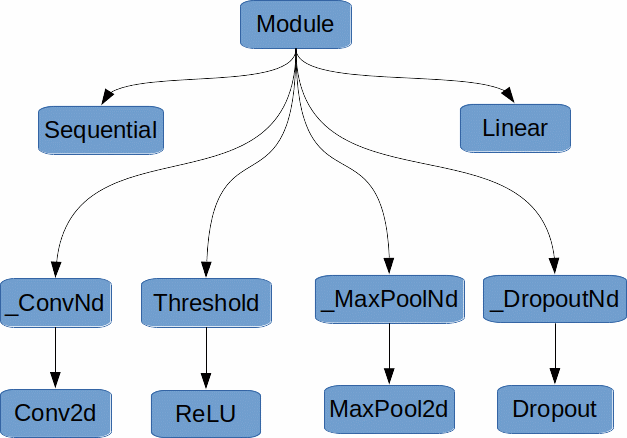

# Source Code studies: Implementation of AlexNet in Pytorch
Learn Pytorch internals from its implementation of AlexNet

PURPOSE: PRIVATE WORKING NOTES

The plan is to 
* walk through all the layers: from AlexNet python class to cuDNN (or low layer CPU) functions.
* see where the backend layers (CPU/GPU) are set; where is the correct place to put, say, ARM-based backend

Links:

"A Walk-through of AlexNet" by Hao Gao in Medium [link](https://medium.com/@smallfishbigsea/a-walk-through-of-alexnet-6cbd137a5637)

AlexNet class in PyTorch is defined [link](https://github.com/pytorch/vision/blob/master/torchvision/models/alexnet.py)

"A Tour of PyTorch Internals (Part I)" is [link](https://pytorch.org/blog/a-tour-of-pytorch-internals-1/)

"PyTorch Internals" (Part II) - The Build System" is [link](https://pytorch.org/blog/a-tour-of-pytorch-internals-2/)

PyTorch issue: "Implement similar PyTorch function as model.summary() in keras?" is [here](https://github.com/pytorch/pytorch/issues/2001)

Stackoverflow: "What's the best way to generate a UML diagram from Python source code?" [here](https://stackoverflow.com/questions/260165/whats-the-best-way-to-generate-a-uml-diagram-from-python-source-code)

## class AlexNet
Everything is a Module. AlexNet itself and all its defining elements inherit from the class Module. 
`Sequential<-Module` 
`Conv2d<-_ConvNd<-Module` 
`ReLU<-Threshold<-Module` 
`MaxPool2d<-_MaxPoolNd<-Module`  
`Dropout<-_DropoutNd<-Module` 
`Linear<-Module` 

## class Module
